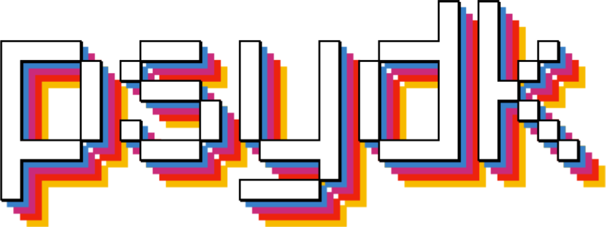

### High-performance, low-latency, cross-platform experiment framework for the cognitive sciences.

> [!WARNING]
> This project is still a bit experimental, and not everything is completely working yet. Feel free to try it out and provide feedback, but be aware that things may change rapidly and that there may be bugs. **If you're interested in using psydk for your research, please feel free to reach out!**

[](https://pypi.org/project/psydk/)  

psydk is a framework for psychophysics, neuroscience and general congitive experiment.

## Features

- **Accurate timing**: psydk uses the best available timing APIs on each platform to ensure that stimuli are presented at the right time and that you can synchronize your experiment with external devices (currently only supported on Windows and Mac OS).
- **High performance**: psydk is pretty fast. It uses the GPU (via the very mature Skia library) to render vector and raster stimuli.
- **Cross-platform**: psydk runs on Windows, Mac OS, Linux, Android, and iOS (and maybe the web in the future?).
- **Easy to use**: psydk is designed to be easy to use. You can write your experiment in Python and use the provided tools to run it on any platform.
- **Open-source**: psydk is open-source and free to use. You can use it for commercial and non-commercial projects.

## Getting Started

To get started with psydk, install it via pip or [pixi](https://pixi.sh/dev/):

```bash
# Using pip
pip install psydk
# Using pixi
pixi add psydk --pypi
```

Create a new Python file (e.g., `experiment.py` - or `__main_.py` if you want to run it as a module) and add the following code:

```python
from psydk import run, Experiment, TextStimulus

def experiment(ctx):
    with ctx.create_default_window() as window:
        text = TextStimulus("Hello, psydk!")

        for frame in window.get_frame():
            window.draw(text)

if __name__ == "__main__":
    run(experiment)
```

You can then run your experiment using Python:

```bash
python experiment.py # or whatever your file is called
```

## Running on iOS

Psydk experiments can be run through a dedicated iOS app that serves as a launcher for psydk-based projects. Please refer to the [psydk-launcher README](./apps/README.md) for more information on how to set up and use the launcher app.

iOS-compatible wheels are available on PyPi. If you don't want to use the launcher app, you can also build your own iOS app using psydk as a dependency, e.g. using [Briefcase](https://docs.beeware.org/en/latest/tutorial/tutorial-5/iOS.html) and specifying psydk in your `pyproject.toml`.

## Code Structure

Psydk is split into a number of different crates/libraries:

- `psydk`: The core functionality of psydk. This is used to build the Python bindings using PyO3.
- `psydk-renderer`: The rendering engine for psydk.
- `psydk-audio`: A library for playing audio with accurate timing.
